# Diagrama de Clases - Sistema Uno Mas

## Descripción
Diagrama de clases UML del sistema para gestión de encuentros deportivos, implementando los patrones de diseño requeridos.

## Patrones de Diseño Implementados
- **State**: Para el manejo de estados del partido
- **Factory**: Para la creación de diferentes tipos de partidos según el deporte
- **Strategy**: Para algoritmos de emparejamiento de jugadores
- **Observer**: Para el sistema de notificaciones
- **Adapter**: Para integración con servicios externos (Firebase, JavaMail)

## Diagrama

```mermaid
classDiagram
    direction TB
    class Emparejador {
        - estrategia: EstrategiaEmparejamiento
        + emparejarJugadores(partido: Partido): Equipo
        + cambiarEstrategia(nuevaEstrategia: EstrategiaEmparejamiento)
    }
    class Usuario {
        -nombre: string
        -email: string
        -contraseña: string
        -deporteFavorito: string
        %% principiante, intermedio, avanzado
        -nivel: string 
        -ubicacion: Ubicacion
    }
    class Partido {
        -fecha: string
        -deporte: string
        -cantJugadoresRequeridos: int
        -duracion: int
        -estadoActual: EstadoPartido
        -equipo: Equipo
        -nivelMinimo: string
        -nivelMaximo: string
        -ubicacion: Ubicacion
        -notificacionManager: NotificacionManager
        + cambiarEstado(nuevoEstado: EstadoPartido)
        + agregarJugador(usuario: Usuario)
        + confirmarPartido()
        + cancelarPartido()
        + iniciarPartido()
        + finalizarPartido()
        - notificarEvento(evento: EventoPartido)
    }

    class Ubicacion {
        -latitud: float
        -longitud: float
        -radio: float
    }
    
    namespace PatronState {
        class EstadoPartido {
            <<interface>>
            + manejarCambioEstado(partido: Partido)
            + puedeAgregarJugador(): boolean
            + puedeConfirmar(): boolean
            + puedeCancelar(): boolean
            + puedeIniciar(): boolean
            + puedesFinalizar(): boolean
            + getNombreEstado(): string
        }
        
        class NecesitamosJugadores {
            + manejarCambioEstado(partido: Partido)
            + puedeAgregarJugador(): boolean
            + puedeConfirmar(): boolean
            + puedeCancelar(): boolean
            + puedeIniciar(): boolean
            + puedeFinalizar(): boolean
            + getNombreEstado(): string
        }
        
        class PartidoArmado {
            + manejarCambioEstado(partido: Partido)
            + puedeAgregarJugador(): boolean
            + puedeConfirmar(): boolean
            + puedeCancelar(): boolean
            + puedeIniciar(): boolean
            + puedeFinalizar(): boolean
            + getNombreEstado(): string
        }
        
        class Confirmado {
            + manejarCambioEstado(partido: Partido)
            + puedeAgregarJugador(): boolean
            + puedeConfirmar(): boolean
            + puedeCancelar(): boolean
            + puedeIniciar(): boolean
            + puedeFinalizar(): boolean
            + getNombreEstado(): string
        }
        
        class EnJuego {
            + manejarCambioEstado(partido: Partido)
            + puedeAgregarJugador(): boolean
            + puedeConfirmar(): boolean
            + puedeCancelar(): boolean
            + puedeIniciar(): boolean
            + puedeFinalizar(): boolean
            + getNombreEstado(): string
        }
        
        class Finalizado {
            + manejarCambioEstado(partido: Partido)
            + puedeAgregarJugador(): boolean
            + puedeConfirmar(): boolean
            + puedeCancelar(): boolean
            + puedeIniciar(): boolean
            + puedeFinalizar(): boolean
            + getNombreEstado(): string
        }
        
        class Cancelado {
            + manejarCambioEstado(partido: Partido)
            + puedeAgregarJugador(): boolean
            + puedeConfirmar(): boolean
            + puedeCancelar(): boolean
            + puedeIniciar(): boolean
            + puedeFinalizar(): boolean
            + getNombreEstado(): string
        }
    }
    
    
    
    class Equipo {
        - nombre: string
        - jugadores: list~Usuario~
        + agregarJugador(jugador: Usuario)
        + eliminarJugador(jugador: Usuario)
        + cantidadJugadores(): int
    }
    
    namespace PatronFactory {
        class PartidoFactory {
            <<abstract>>
            + crearPartido(fecha: string, ubicacion: Ubicacion): Partido
            + configurarReglas(partido: Partido)
        }
        
        class FutbolFactory {
            + crearPartido(fecha: string, ubicacion: Ubicacion): Partido
            + configurarReglas(partido: Partido)
        }
        
        class BasquetFactory {
            + crearPartido(fecha: string, ubicacion: Ubicacion): Partido
            + configurarReglas(partido: Partido)
        }
        
        class VoleyFactory {
            + crearPartido(fecha: string, ubicacion: Ubicacion): Partido
            + configurarReglas(partido: Partido)
        }
        
        class TenisFactory {
            + crearPartido(fecha: string, ubicacion: Ubicacion): Partido
            + configurarReglas(partido: Partido)
        }
    }
    
    namespace PatronStrategy {
        class EstrategiaEmparejamiento {
            <<interface>>
            + emparejar(jugadoresDisponibles: list~Usuario~, partido: Partido): Equipo
            + esCompatible(usuario: Usuario, partido: Partido): boolean
        }
        
        class EmparejamientoPorNivel {
            + emparejar(jugadoresDisponibles: list~Usuario~, partido: Partido): Equipo
            + esCompatible(usuario: Usuario, partido: Partido): boolean
            - validarNivelMinimo(usuario: Usuario, partido: Partido): boolean
            - validarNivelMaximo(usuario: Usuario, partido: Partido): boolean
        }
        
        class EmparejamientoPorCercania {
            + emparejar(jugadoresDisponibles: list~Usuario~, partido: Partido): Equipo
            + esCompatible(usuario: Usuario, partido: Partido): boolean
            - calcularDistancia(ubicacion1: Ubicacion, ubicacion2: Ubicacion): float
            - filtrarPorRadio(jugadores: list~Usuario~, ubicacion: Ubicacion): list~Usuario~
        }
        
        class EmparejamientoPorHistorial {
            + emparejar(jugadoresDisponibles: list~Usuario~, partido: Partido): Equipo
            + esCompatible(usuario: Usuario, partido: Partido): boolean
            - obtenerHistorial(usuario: Usuario): list~Partido~
            - calcularCompatibilidad(usuario1: Usuario, usuario2: Usuario): float
        }
        
        class EmparejamientoMixto {
            + emparejar(jugadoresDisponibles: list~Usuario~, partido: Partido): Equipo
            + esCompatible(usuario: Usuario, partido: Partido): boolean
            - combinarCriterios(jugadores: list~Usuario~, partido: Partido): list~Usuario~
        }
    }
    
    namespace PatronAdapter {
        class ServicioEmail {
            <<interface>>
            + enviarEmail(destinatario: string, asunto: string, mensaje: string): boolean
        }
        
        class ServicioPush {
            <<interface>>
            + enviarPush(usuario: Usuario, titulo: string, mensaje: string): boolean
        }
        
        class JavaMailAdapter {
            - session: Session
            + enviarEmail(destinatario: string, asunto: string, mensaje: string): boolean
            - configurarSMTP(): Properties
            - crearMensajeEmail(destinatario: string, asunto: string, mensaje: string): MimeMessage
        }
        
        class FirebaseAdapter {
            - firebaseApp: FirebaseApp
            + enviarPush(usuario: Usuario, titulo: string, mensaje: string): boolean
            - obtenerTokenUsuario(usuario: Usuario): string
            - construirMensajeFirebase(token: string, titulo: string, mensaje: string): Message
        }
    }
    
    namespace PatronObserver {
        class NotificacionObserver {
            <<interface>>
            + notificar(evento: EventoPartido, partido: Partido)
        }
        
        class EmailNotificador {
            - servicioEmail: ServicioEmail
            + notificar(evento: EventoPartido, partido: Partido)
            - construirMensaje(evento: EventoPartido, partido: Partido): string
        }
        
        class PushNotificador {
            - servicioPush: ServicioPush
            + notificar(evento: EventoPartido, partido: Partido)
            - construirMensajePush(evento: EventoPartido, partido: Partido): string
        }
        
        class NotificacionManager {
            - observers: list~NotificacionObserver~
            + agregarObserver(observer: NotificacionObserver)
            + eliminarObserver(observer: NotificacionObserver)
            + notificarObservers(evento: EventoPartido, partido: Partido)
            + suscribirUsuario(usuario: Usuario, tipoNotificacion: string)
        }
        
        class EventoPartido {
            <<enumeration>>
            PARTIDO_CREADO
            PARTIDO_ARMADO
            PARTIDO_CONFIRMADO
            PARTIDO_EN_JUEGO
            PARTIDO_FINALIZADO
            PARTIDO_CANCELADO
            JUGADOR_UNIDO
        }
    }
    
    %% Relaciones del patrón State
    EstadoPartido <|.. NecesitamosJugadores
    EstadoPartido <|.. PartidoArmado
    EstadoPartido <|.. Confirmado
    EstadoPartido <|.. EnJuego
    EstadoPartido <|.. Finalizado
    EstadoPartido <|.. Cancelado
    
    %% Relación de composición - Partido tiene un estado
    Partido *-- EstadoPartido : contiene
    
    %% Relaciones del patrón Factory
    PartidoFactory <|-- FutbolFactory
    PartidoFactory <|-- BasquetFactory
    PartidoFactory <|-- VoleyFactory
    PartidoFactory <|-- TenisFactory
    
    PartidoFactory ..> Partido : crea
    
    %% Relaciones del patrón Strategy
    EstrategiaEmparejamiento <|.. EmparejamientoPorNivel
    EstrategiaEmparejamiento <|.. EmparejamientoPorCercania
    EstrategiaEmparejamiento <|.. EmparejamientoPorHistorial
    EstrategiaEmparejamiento <|.. EmparejamientoMixto
    
    Emparejador --> EstrategiaEmparejamiento : usa
    
    %% Relaciones del patrón Adapter
    ServicioEmail <|.. JavaMailAdapter
    ServicioPush <|.. FirebaseAdapter
    
    %% Relaciones del patrón Observer
    NotificacionObserver <|.. EmailNotificador
    NotificacionObserver <|.. PushNotificador
    
    EmailNotificador --> ServicioEmail : usa
    PushNotificador --> ServicioPush : usa
    
    NotificacionManager --> NotificacionObserver : notifica
    Partido --> NotificacionManager : usa
    NotificacionManager --> EventoPartido : maneja
    
    %% Otras relaciones
    Emparejador --> Partido : gestiona
    Equipo --> Usuario : contiene

    Partido "1" --> "1" Ubicacion
    Partido "0" --> "*" Equipo: tiene equipos

    Usuario "1" --> "1" Ubicacion : tiene
```

## Explicación de los Patrones Implementados

### 1. Patrón State
- **Propósito**: Manejo de los diferentes estados del partido
- **Implementación**: `EstadoPartido` como interfaz, con estados concretos como `NecesitamosJugadores`, `PartidoArmado`, `Confirmado`, etc.
- **Beneficio**: Permite cambios de estado controlados y comportamientos específicos para cada estado

### 2. Patrón Factory
- **Propósito**: Creación de partidos específicos para cada deporte
- **Implementación**: `PartidoFactory` abstracta con factories concretas para fútbol, básquet, vóley y tenis
- **Beneficio**: Encapsula la lógica de creación y configuración específica de cada deporte

### 3. Patrón Strategy
- **Propósito**: Diferentes algoritmos de emparejamiento de jugadores
- **Implementación**: `EstrategiaEmparejamiento` como interfaz con estrategias por nivel, cercanía, historial y mixta
- **Beneficio**: Permite cambiar dinámicamente el algoritmo de emparejamiento

### 4. Patrón Observer
- **Propósito**: Sistema de notificaciones para eventos del partido
- **Implementación**: `NotificacionObserver` como interfaz con notificadores para email y push
- **Beneficio**: Desacopla la lógica de notificación del objeto partido

### 5. Patrón Adapter
- **Propósito**: Integración uniforme con servicios externos
- **Implementación**: `ServicioEmail` y `ServicioPush` como interfaces, con adapters para JavaMail y Firebase
- **Beneficio**: Interfaz uniforme independiente de la implementación del servicio externo 